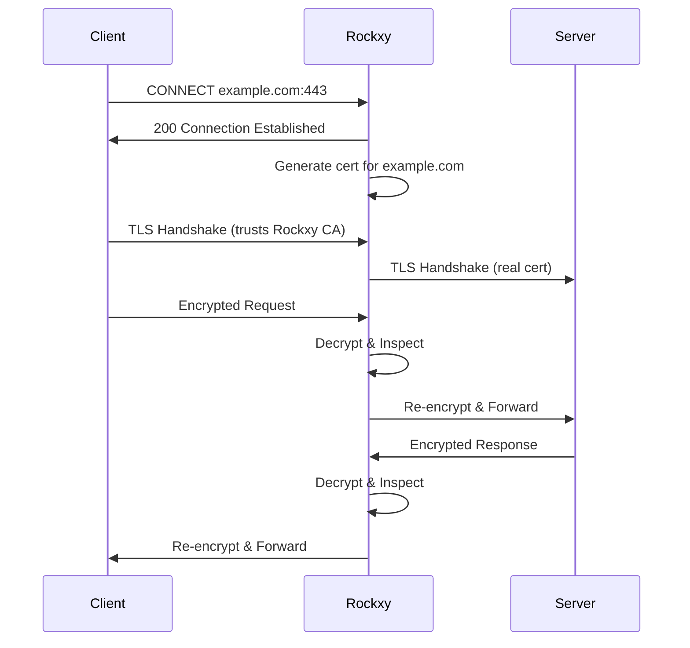

Rockxy decrypts HTTPS traffic by acting as a man-in-the-middle proxy. It generates a local root Certificate Authority, creates per-host certificates on the fly, and presents them to clients so you can inspect encrypted requests and responses in plain text.

<Frame caption="HTTPS request with decrypted headers and body visible in the inspector">
  
</Frame>

## How It Works

When a client sends an HTTP CONNECT request to establish an HTTPS tunnel, Rockxy intercepts the connection, generates a certificate for the target host, and performs two separate TLS handshakes — one with the client (using the generated certificate) and one with the real server.

The client sees a valid certificate signed by Rockxy's root CA. As long as the root CA is trusted in the macOS Keychain, the client accepts it without errors.

## Entry Points

| Action | How to Access |
|--------|---------------|
| Install Root CA | **Certificate > Install on This Mac...** |
| SSL Proxying List | **Tools > SSL Proxying List...** |
| Certificate state | **Settings > General** root CA panel, Welcome flow, and Advanced diagnostics |

## Certificate Setup

Follow these steps to enable HTTPS interception:

1. **Generate Root CA** — Rockxy automatically generates a root CA certificate on first launch. No manual action needed.
2. **Install and trust** — Open `Certificate → Install on This Mac...` from the menu bar, or use the root CA panel in **Settings > General**. Rockxy drives the install/trust flow through its helper and certificate manager.
3. **Verify trust** — If an app still rejects HTTPS interception, open Keychain Access and verify the Rockxy root is trusted.
4. **Restart Target Apps** — Some apps cache TLS sessions. Restart them after trusting the CA to pick up the change.

<Warning>
HTTPS interception will not work until you trust the Rockxy root CA in Keychain Access. Without trust, clients will reject the generated certificates and you will see TLS handshake errors instead of decrypted traffic.
</Warning>

## Root CA Certificate

Rockxy generates its root CA using the swift-certificates library:

- **Key type** — P-256 (ECDSA)
- **Validity** — 2 years from generation date
- **Storage** — private key stored in the macOS Keychain via `SecKeychain`
- **Subject** — common name `Rockxy Root CA`, with a unique serial number per installation

The root CA is generated once and reused across sessions. If you delete it from the Keychain, Rockxy will generate a new one on next launch.

<Note>
The root CA private key never leaves your Mac. It is stored exclusively in the macOS Keychain and is not exported or transmitted anywhere. Each Rockxy installation generates its own unique root CA.
</Note>

## Per-Host Certificates

When Rockxy encounters an HTTPS request to a new hostname, it generates a certificate for that host on the fly:

- **Signed by** — your local Rockxy root CA
- **Subject Alternative Name** — matches the requested hostname
- **Validity** — 1 year from generation
- **Cache** — LRU cache holding up to 1,000 host certificates in memory

Cached certificates are reused for subsequent requests to the same host. When the cache reaches capacity, the least recently used certificates are evicted and regenerated on demand.

## Certificate Inspector

Open **Certificate** from the menu bar to see the root CA panel, install/trust status, and links to the SSL Proxying list and the Mac Setup Guide. The **Settings > General** root CA panel surfaces the same status alongside the Welcome flow and advanced diagnostics.

When you need to inspect a remote server's actual TLS chain (leaf, intermediates, root), use Keychain Access or a command-line tool such as `openssl s_client -connect host:443 -showcerts` — Rockxy does not expose a per-transaction certificate-chain tab today.

## SSL Proxying List

By default, Rockxy does **not** decrypt any HTTPS traffic. You must add domains to the SSL Proxying List to enable interception for specific hosts.

Open `Tools → SSL Proxying List…` to manage the list:

- **Add domains** individually (e.g., `api.example.com`) or with wildcards (e.g., `*.example.com`)
- **Enable/disable** individual rules without removing them
- **Presets** — one-click to add common API domains (googleapis.com, github.com, stripe.com, etc.)
- **Import/Export** — share SSL proxying lists as JSON files between machines

Domains *not* in the list pass through as raw encrypted tunnels — Rockxy relays the bytes without decryption, so the connection works normally but traffic is not visible in the inspector.

<Tip>
Start with a narrow list of domains you are actively debugging. Intercepting all HTTPS traffic is unnecessary and can cause issues with certificate-pinned apps.
</Tip>

## Security Considerations

<Warning>
Trusting the Rockxy root CA means any certificate signed by it will be accepted by your system. While the private key is stored securely in the Keychain, you should be aware of the implications:

- Any process with Keychain access could theoretically use the root CA to sign certificates
- Remove the root CA from Keychain Access when you are not actively debugging HTTPS traffic
- Never distribute or share your Rockxy root CA certificate or private key
</Warning>

To remove the root CA and disable HTTPS interception:

1. Open **Keychain Access**
2. Search for "Rockxy Root CA"
3. Right-click and select **Delete**
4. Restart any apps that cached the TLS session

## Troubleshooting

### Certificate not trusted

**Symptom:** Browsers show "Your connection is not private" or apps fail with TLS errors.

**Fix:** Open Keychain Access, find "Rockxy Root CA", and verify the trust setting is "Always Trust". If missing, reinstall via `Certificate → Install on This Mac...`.

### App uses certificate pinning

**Symptom:** A specific app refuses to connect through Rockxy even though other apps work fine.

**Fix:** Apps with certificate pinning (many banking, security, and first-party Apple apps) reject any certificate not matching their pinned set. Exclude these apps from the proxy or use the Rule Engine to bypass specific domains.

### Proxy port conflict

**Symptom:** Rockxy fails to start with a "port already in use" error.

**Fix:** Another process is using the configured proxy port (default `9090`). Check with `lsof -i :9090` and either stop the conflicting process or change Rockxy's port in **Settings > General**.

### Stale TLS sessions

**Symptom:** HTTPS interception works for new domains but not for previously visited ones.

**Fix:** Some apps and browsers cache TLS sessions. Restart the target app after installing and trusting the Rockxy root CA.

## Next Steps

<CardGroup cols={2}>
  <Card title="Traffic Capture" icon="satellite-dish" href="/features/traffic-capture">
    Learn the full traffic capture workflow and inspector features
  </Card>
  <Card title="Traffic Rules" icon="filter" href="/features/rules">
    Block, redirect, or modify HTTPS requests with the Rule Engine
  </Card>
</CardGroup>
